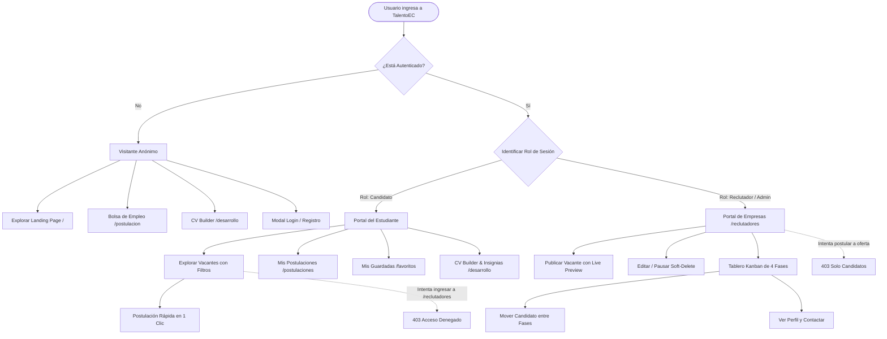
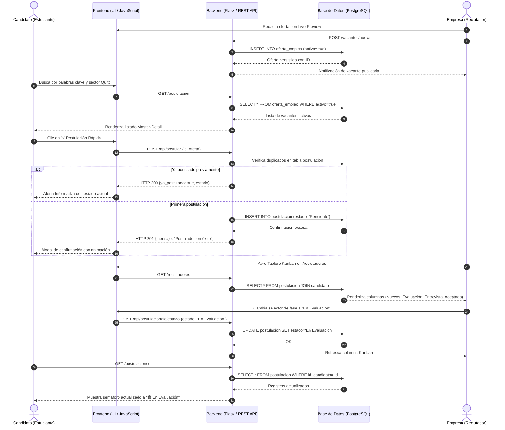
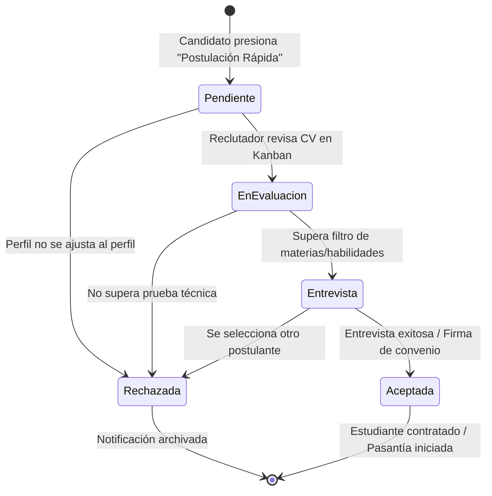

# 📖 Manual de Usuario — Plataforma TalentoEC

> **Plataforma Web Universitaria de Empleo y Pasantías de Quito**  
> **Pontificia Universidad Católica del Ecuador (PUCE)**  
> **Versión del Documento:** 1.0.0 — Ciclo Académico 2026  
> **Autores:** Isaac Oña, Leandro Frutos, Axel Masache  

---

## 📑 Tabla de Contenidos

1. [Información General y Metadatos](#1-información-general-y-metadatos)
   - [1.1. Propósito y Contexto de la Plataforma](#11-propósito-y-contexto-de-la-plataforma)
   - [1.2. Audiencia Objetivo en Quito](#12-audiencia-objetivo-en-quito)
   - [1.3. Credenciales de Prueba Preconfiguradas](#13-credenciales-de-prueba-preconfiguradas)
   - [1.4. Matriz de Control de Acceso Basado en Roles (RBAC)](#14-matriz-de-control-de-acceso-basado-en-roles-rbac)
2. [Acceso al Sistema y Gestión de Cuenta](#2-acceso-al-sistema-y-gestión-de-cuenta)
   - [2.1. Acceso en Entorno Local](#21-acceso-en-entorno-local)
   - [2.2. Registro de Nuevos Candidatos](#22-registro-de-nuevos-candidatos)
   - [2.3. Registro de Nuevas Empresas / Reclutadores](#23-registro-de-nuevas-empresas--reclutadores)
   - [2.4. Inicio de Sesión y Persistencia](#24-inicio-de-sesión-y-persistencia)
   - [2.5. Cierre Seguro de Sesión](#25-cierre-seguro-de-sesión)
3. [Módulo del Candidato](#3-módulo-del-candidato)
   - [3.1. Búsqueda y Exploración de Vacantes (`/postulacion`)](#31-búsqueda-y-exploración-de-vacantes-postulacion)
   - [3.2. Arquitectura de Navegación Master-Detail](#32-arquitectura-de-navegación-master-detail)
   - [3.3. Postulación Rápida en 1 Clic](#33-postulación-rápida-en-1-clic)
   - [3.4. Historial de Postulaciones y Semáforo de Estados (`/postulaciones`)](#34-historial-de-postulaciones-y-semáforo-de-estados-postulaciones)
   - [3.5. Bolsa de Favoritos y Vacantes Guardadas (`/favoritos`)](#35-bolsa-de-favoritos-y-vacantes-guardadas-favoritos)
   - [3.6. CV Builder y Desarrollo Profesional (`/desarrollo`)](#36-cv-builder-y-desarrollo-profesional-desarrollo)
4. [Módulo del Reclutador](#4-módulo-del-reclutador)
   - [4.1. Panel Principal de Reclutadores (`/reclutadores`)](#41-panel-principal-de-reclutadores-reclutadores)
   - [4.2. Publicación de Vacantes con Live Preview Interactivo](#42-publicación-de-vacantes-con-live-preview-interactivo)
   - [4.3. Edición de Ofertas de Empleo (`/vacantes/<id>/editar`)](#43-edición-de-ofertas-de-empleo-vacantesideditar)
   - [4.4. Pausa Suave (*Soft Delete*) y Reactivación de Vacantes](#44-pausa-suave-soft-delete-y-reactivación-de-vacantes)
   - [4.5. Tablero Kanban Vivo de Selección](#45-tablero-kanban-vivo-de-selección)
   - [4.6. Visor Modal de Perfil del Candidato](#46-visor-modal-de-perfil-del-candidato)
5. [Diagramas de Flujo y Procesos (Mermaid)](#5-diagramas-de-flujo-y-procesos-mermaid)
   - [5.1. Flujo de Navegación por Rol](#51-flujo-de-navegación-por-rol)
   - [5.2. Ciclo de Vida de una Postulación](#52-ciclo-de-vida-de-una-postulación)
   - [5.3. Máquina de Estados del Pipeline Kanban](#53-máquina-de-estados-del-pipeline-kanban)
6. [Preguntas Frecuentes (FAQ) y Soporte Técnico](#6-preguntas-frecuentes-faq-y-soporte-técnico)

---

## 1. Información General y Metadatos

### 1.1. Propósito y Contexto de la Plataforma

**TalentoEC** es una plataforma web creada para resolver la brecha de inserción laboral que enfrentan los estudiantes universitarios y recién graduados de Quito, Ecuador. Muchas bolsas tradicionales de empleo exigen años de experiencia laboral previa para posiciones junior, generando frustración en la juventud académica.

TalentoEC transforma esta realidad mediante:
- Filtros específicos de ofertas formativas clasificadas como **"Sin Experiencia"**.
- Convenios para **Pasantías Preprofesionales** avaladas según la normativa laboral ecuatoriana.
- Un mecanismo ágil de **Postulación en 1 Clic** que elimina formularios redundantes.
- Herramientas de **CV Builder con IA** para resaltar habilidades adquiridas en el aula.
- Un **Tablero Kanban interactivo** para que las empresas gestionen postulantes con transparencia.

```
┌─────────────────────────────────────────────────────────────────────────┐
│                              TALENTOEC                                  │
│             Plataforma Universitaria de Empleo de Quito                 │
│                                                                         │
│  [Estudiantes / Egresados]                     [Empresas / Reclutadores]│
│            │                                              │             │
│            ▼                                              ▼             │
│   • Búsqueda por sectores                       • Publicación Live Preview│
│   • Postulación 1-Clic                          • Pausa Suave (Soft-Del)│
│   • Semáforo de 4 estados                       • Tablero Kanban Vivo   │
│   • CV Builder con IA                           • Visor de Currículums  │
│            │                                              │             │
│            └───────────────► [PostgreSQL] ◄───────────────┘             │
└─────────────────────────────────────────────────────────────────────────┘
```

---

### 1.2. Audiencia Objetivo en Quito

El sistema está diseñado para atender a dos grandes comunidades dentro del Distrito Metropolitano de Quito y sus valles:

1. **Estudiantes y Jóvenes Profesionales:**
   - Estudiantes de pregrado de universidades locales (PUCE, EPN, UCE, USFQ, UDLA, UIDE, UPS).
   - Bachilleres técnicos y egresados recientes en busca de su primera oportunidad formal o pasantía de ley.
   - Residentes de sectores como La Carolina, Cumbayá, Quitumbe, Centro Histórico, Carcelén, Tumbaco y modalidades remotas.

2. **Reclutadores y Gestores de Talento Humano:**
   - Oficiales de selección de pequeñas, medianas y grandes empresas radicadas en Ecuador.
   - Startups tecnológicas y agencias de diseño o marketing que buscan talento emergente con habilidades prácticas demostrables.

---

### 1.3. Credenciales de Prueba Preconfiguradas

Para facilitar la evaluación académica, testing funcional y demostraciones en vivo, la base de datos cuenta con cuentas de demostración listas para usar:

| Perfil de Usuario | Rol del Sistema | Correo Electrónico | Contraseña | Propósito de Prueba |
| :--- | :--- | :--- | :--- | :--- |
| **Candidato Estudiante** | `candidato` | `estudiante@ejemplo.com` | `password123` | Explorar vacantes, aplicar en 1 clic, revisar semáforo de postulaciones, guardar favoritos y editar CV. |
| **Reclutador Corporativo** | `reclutador` | `empresa@ejemplo.com` | `password123` | Publicar ofertas con Live Preview, editar, pausar ofertas y gestionar candidatos en el tablero Kanban. |
| **Administrador General** | `admin` | `admin@ejemplo.com` | `password123` | Auditoría global, gestión técnica de ofertas y control integral del pipeline. |

> [!TIP]
> **Consejo de Inicio Rápido:**  
> Puedes abrir dos ventanas del navegador (una normal y otra en modo incógnito) para simular simultáneamente la postulación de un estudiante y la recepción inmediata del candidato en el Kanban del reclutador.

---

### 1.4. Matriz de Control de Acceso Basado en Roles (RBAC)

La plataforma aplica un estricto control de acceso basado en roles (*Role-Based Access Control*) en el backend mediante decoradores Flask (`@login_requerido` y `@rol_requerido`):

| Funcionalidad / Módulo | Visitante Anónimo | Rol `candidato` | Rol `reclutador` | Rol `admin` | Código / Ruta |
| :--- | :---: | :---: | :---: | :---: | :--- |
| Ver Landing Page e Inicio | ✅ Sí | ✅ Sí | ✅ Sí | ✅ Sí | `GET /` |
| Consultar Bolsa de Empleo | ✅ Sí | ✅ Sí | ✅ Sí *(Solo Lectura)* | ✅ Sí | `GET /postulacion` |
| Ver Detalle de Oferta | ✅ Sí | ✅ Sí | ✅ Sí | ✅ Sí | `GET /api/ofertas/<id>` |
| Usar CV Builder y Plantillas | ✅ Sí | ✅ Sí | ❌ No | ✅ Sí | `GET /desarrollo` |
| Registrar Nueva Cuenta | ✅ Sí | ❌ Redirige | ❌ Redirige | ❌ Redirige | `POST /registro` |
| Iniciar Sesión / Logout | ✅ Sí | ✅ Sí | ✅ Sí | ✅ Sí | `POST /login`, `/logout` |
| Postulación en 1 Clic | ❌ Requiere Login | ✅ **Exclusivo** | ❌ **403 Forbidden** | ❌ **403 Forbidden** | `POST /api/postular` |
| Historial de Mis Postulaciones | ❌ No | ✅ **Exclusivo** | ❌ **403 Forbidden** | ❌ **403 Forbidden** | `GET /postulaciones` |
| Bolsa de Favoritos (⭐) | ❌ No | ✅ **Exclusivo** | ❌ **403 Forbidden** | ❌ **403 Forbidden** | `GET /favoritos` |
| Portal de Reclutadores | ❌ No | ❌ **403 Forbidden** | ✅ **Autorizado** | ✅ **Autorizado** | `GET /reclutadores` |
| Publicar Nueva Vacante | ❌ No | ❌ **403 Forbidden** | ✅ **Autorizado** | ✅ **Autorizado** | `POST /vacantes/nueva` |
| Editar Vacante Propia | ❌ No | ❌ **403 Forbidden** | ✅ **Autorizado** | ✅ **Autorizado** | `POST /vacantes/<id>/editar` |
| Pausar Vacante (*Soft Delete*) | ❌ No | ❌ **403 Forbidden** | ✅ **Autorizado** | ✅ **Autorizado** | `POST /vacantes/<id>/desactivar` |
| Reactivar Vacante | ❌ No | ❌ **403 Forbidden** | ✅ **Autorizado** | ✅ **Autorizado** | `POST /vacantes/<id>/reactivar` |
| Mover Candidatos en Kanban | ❌ No | ❌ **403 Forbidden** | ✅ **Autorizado** | ✅ **Autorizado** | `POST /api/postulacion/<id>/estado` |
| Ver Visor de CV de Candidatos | ❌ No | ❌ **403 Forbidden** | ✅ **Autorizado** | ✅ **Autorizado** | Modal UI en `/reclutadores` |

> [!IMPORTANT]
> **Aislamiento Estricto de Roles:**  
> Por diseño de seguridad, un reclutador **no puede postularse** a vacantes de empleo (recibirá un error `403`), y un candidato **no puede ingresar** al portal administrativo ni modificar el estado de postulaciones ajenas.

---

## 2. Acceso al Sistema y Gestión de Cuenta

### 2.1. Acceso en Entorno Local

1. Abre tu navegador web de preferencia (Google Chrome, Mozilla Firefox, Microsoft Edge o Safari).
2. Ingresa la URL del servidor local:
   ```
   http://127.0.0.1:5000
   ```
   o alternativamente:
   ```
   http://localhost:5000
   ```
3. En la barra superior de navegación (*Main Header*), visualizarás el logotipo **TalentoEC**, los enlaces de navegación y los botones de autenticación:
   - **[Crear Cuenta]**: Abre el modal en la pestaña de registro.
   - **[Iniciar Sesión]**: Abre el modal en la pestaña de acceso.

---

### 2.2. Registro de Nuevos Candidatos

Si eres un estudiante o egresado universitario, sigue estos pasos para habilitar tu cuenta:

```
┌─────────────────────────────────────────────────────────────┐
│                 REGISTRO DE NUEVO USUARIO                   │
│                                                             │
│   Tipo de Perfil:                                           │
│   [ ● Soy Candidato ]        [   Soy Empresa / Reclutador ] │
│                                                             │
│   Nombre Completo *:                                        │
│   [ Juan Carlos Pérez                                    ]  │
│                                                             │
│   Correo Institucional o Personal *:                        │
│   [ jperez@puce.edu.ec                                   ]  │
│                                                             │
│   Edad:                             Salario Pretendido ($): │
│   [ 21          ]                   [ 550.00             ]  │
│                                                             │
│   Contraseña *:                                             │
│   [ **********                                           ]  │
│                                                             │
│              [ Crear Cuenta Gratuita ]                      │
└─────────────────────────────────────────────────────────────┘
```

1. Haz clic en el botón **Crear Cuenta** en la esquina superior derecha.
2. Asegúrate de que el selector de rol esté en **"Soy Candidato"** (botón azul activo).
3. Completa los campos solicitados:
   - **Nombre Completo:** Tu nombre y apellidos (mínimo 2 caracteres).
   - **Correo Electrónico:** Dirección válida (ej. `tu_nombre@puce.edu.ec` o `usuario@gmail.com`). Debe cumplir con el estándar RFC 5322 verificado por expresión regular.
   - **Edad:** Tu edad actual (debe encontrarse en el rango de 16 a 99 años).
   - **Salario Pretendido:** Monto mensual en USD que aspiras percibir (opcional, ej. `500.00`).
   - **Contraseña:** Clave de acceso con una longitud mínima de 6 caracteres.
4. Presiona **[Crear Cuenta Gratuita]**.
5. El sistema cifrará tu contraseña mediante PBKDF2 SHA-256, creará tu sesión automáticamente y te redirigirá a la página de bienvenida con un mensaje de confirmación en color verde.

---

### 2.3. Registro de Nuevas Empresas / Reclutadores

Si representas a una compañía o departamento de talento humano en Quito:

1. Haz clic en **Crear Cuenta** en el menú superior.
2. Selecciona la opción **"Soy Empresa / Reclutador"**.
3. El formulario se adaptará dinámicamente:
   - **Nombre del Reclutador:** Nombre de la persona encargada del proceso de selección.
   - **Nombre de la Empresa:** Razón social o nombre comercial de la compañía (ej. `Banco Pichincha`, `Kruger Corp`, `TechSolutions Quito`).
   - **Correo Electrónico Corporativo:** Correo del reclutador (ej. `rrhh@empresa.com.ec`).
   - **Contraseña:** Mínimo 6 caracteres.
4. Presiona **[Crear Cuenta Gratuita]**.
5. **Comportamiento automático del sistema:**  
   Si la empresa indicada aún no existía en el catálogo de PostgreSQL, la plataforma la crea automáticamente en la tabla `empresa` con una calificación inicial de 5.0 estrellas, asocia tu usuario como reclutador y te redirige directamente al **Portal de Reclutadores (`/reclutadores`)**.

---

### 2.4. Inicio de Sesión y Persistencia

1. Presiona **Iniciar Sesión** en el encabezado.
2. Ingresa tu correo electrónico registrado y tu contraseña.
3. Haz clic en **[Iniciar Sesión]**.
4. La plataforma validará tus credenciales:
   - Si son válidas: Se generará una cookie de sesión cifrada (`session`) en tu navegador, mostrando tu nombre y avatar en el navbar.
   - Si son erróneas: Se mostrará una alerta en rojo: *"Correo o contraseña incorrectos"*.

---

### 2.5. Cierre Seguro de Sesión

Para cerrar sesión de manera definitiva y proteger tu privacidad en computadores públicos o universitarios:

1. Ubica tu nombre en la barra superior de navegación.
2. Haz clic sobre el enlace **"Cerrar sesión"** (o en el botón rojo si estás en móviles).
3. El sistema llamará a `/logout`, destruirá la sesión en memoria, limpiará la cookie de sesión del navegador y enviará las cabeceras HTTP:
   ```http
   Cache-Control: no-cache, no-store, must-revalidate
   ```
4. Serás redirigido a la portada principal en estado anónimo.

---

## 3. Módulo del Candidato

El módulo del candidato reúne todas las herramientas requeridas para encontrar empleo, postularse rápidamente y hacer seguimiento a cada etapa del proceso de contratación.

```
┌─────────────────────────────────────────────────────────────────────────┐
│                           MÓDULO DEL CANDIDATO                          │
│                                                                         │
│   [ 1. Explorar ] ──► [ 2. Postular (1-Clic) ] ──► [ 3. Semáforo ]      │
│   Filtros en vivo       Botón naranja `#F97316`    Historial 4 fases    │
│   Sectores Quito        Validación inmediata       Seguimiento continuo │
│                                                                         │
│   [ 4. Mis Favoritos ]                        [ 5. CV Builder & IA ]    │
│   Guardar con estrella ⭐                     6 Plantillas SVG          │
│   Revisar más tarde                           Escaneo inteligente       │
└─────────────────────────────────────────────────────────────────────────┘
```

---

### 3.1. Búsqueda y Exploración de Vacantes (`/postulacion`)

Accede a este módulo mediante el enlace **"Bolsa de Empleo"** del navbar. La interfaz está optimizada para localizar ofertas en Quito en menos de 5 segundos.

```
┌──────────────────────────────────────────────────────────────────────────────────────────────────────────┐
│  🔍 [ Buscar puesto o tecnología (Python, React...) ]  📍 [ Quito, Ecuador ▼ ]   [ 🔎 Buscar ]           │
├──────────────────────────────────────────────────────────────────────────────────────────────────────────┤
│  [ Todos (6) ]  [ ★ Sin Experiencia ]  [ 🌐 Remoto/Híbrido ]  [ 💻 TI & Software ]  [ 🎨 Diseño UX/UI ]   │
└──────────────────────────────────────────────────────────────────────────────────────────────────────────┘
```

#### A. Barra de Búsqueda Integrada
- **Campo de Términos:** Permite ingresar palabras clave como nombres de cargos (*Desarrollador Junior, Pasantía UX/UI, Soporte Técnico*) o tecnologías (*JavaScript, Figma, SQL, Excel*). El filtrado se ejecuta en tiempo real a medida que escribes.
- **Selector de Ubicación con Autocompletado:** Detecta localidades de Quito como *La Carolina, Cumbayá, Quitumbe, Centro Histórico, San Rafael, Tumbaco*, así como la modalidad *Remoto (Todo Ecuador)*.
- **Botón de Búsqueda Instantánea:** Sincroniza la lista de ofertas visibles y actualiza el contador de vacantes activas.

#### B. Carrusel de Filtros por Etiquetas
Justo debajo de la barra se encuentra un carrusel táctil de botones (*pills*):
- **Todos los empleos:** Muestra todas las vacantes publicadas y activas.
- **Sin Experiencia (Destacado):** Filtra exclusivamente aquellas ofertas diseñadas para estudiantes universitarios con 0 años de experiencia laboral previa requerida.
- **Remoto / Híbrido:** Selecciona oportunidades con teletrabajo parcial o total.
- **TI & Software:** Filtra roles de programación, bases de datos y soporte técnico.
- **Diseño UX/UI:** Filtra vacantes de diseño de interfaces, multimedia y diseño gráfico.
- **Marketing Digital:** Filtra puestos de community management, pauta publicitaria y redacción.

---

### 3.2. Arquitectura de Navegación Master-Detail

La pantalla de la bolsa de empleo adopta el patrón de diseño **Master-Detail** para evitar recargas completas y permitir la comparación rápida de ofertas:

```
┌────────────────────────────────────────┬─────────────────────────────────────────────────┐
│     COLUMNA IZQUIERDA (MASTER)         │           COLUMNA DERECHA (DETAIL)              │
├────────────────────────────────────────┼─────────────────────────────────────────────────┤
│ [Ofertas Disponibles en Quito: 4]      │ 💼 Desarrollador Front-End Junior               │
│                                        │ 🏢 Software Solutions EC • 📍 Quito (Remoto)    │
│ ┌────────────────────────────────────┐ │ 💵 $650.00 - $750.00 USD / mes                  │
│ │ [Sin Exp]    $650.00 - $750.00 USD │ ├─────────────────────────────────────────────────┤
│ │ Desarrollador Front-End Junior     │ │ Descripción de la Posición:                     │
│ │ Software Solutions EC              │ │ Buscamos estudiante con entusiasmo...           │
│ │ 📍 Quito (Remoto) • 💼 Híbrido     │ │                                                 │
│ │ [⚡ Postular] [⭐ Guardar]         │ │ Responsabilidades Principales:                  │
│ └────────────────────────────────────┘ │ • Maquetar componentes responsivos con HTML/CSS.│
│                                        │ • Implementar diseños de Figma al píxel.        │
│ ┌────────────────────────────────────┐ │                                                 │
│ │ [Sin Exp]              $460.00 USD │ │ Requisitos Técnicos:                            │
│ │ Pasantía de Diseño UX/UI           │ │ • Estudiante activo a partir de 3er semestre.   │
│ │ Corporación Multimedios            │ │ • Conocimiento básico en JavaScript.            │
│ └────────────────────────────────────┘ │                                                 │
│                                        │ [ ⚡ Postulación Rápida en 1 Clic ]             │
└────────────────────────────────────────┴─────────────────────────────────────────────────┘
```

- **Panel Maestro (Izquierda):** Lista de tarjetas compactas con información clave (título, empresa, salario en USD, insignias y extracto). Al hacer clic en cualquier tarjeta, se marca con borde azul de selección activa.
- **Panel de Detalle (Derecha):** Carga de forma asíncrona (`/api/ofertas/<id>`) la información completa de la oferta: funciones diarias, requisitos técnicos del aspirante, modalidad de horario y beneficios universitarios.
- **Comportamiento en Dispositivos Móviles:** En pantallas menores a 1024px, la selección de una tarjeta despliega el panel de detalle como vista superpuesta con un botón superior **"← Volver al listado"**.

---

### 3.3. Postulación Rápida en 1 Clic

Para postularte no requieres llenar formularios extensos ni adjuntar cartas de motivación repetitivas:

1. Ubica la vacante de tu interés en la lista o en el panel de detalle.
2. Presiona el botón naranja **[⚡ Postulación Rápida]** (`#F97316`).
3. **Validación Automática del Sistema:**
   - **Si no has iniciado sesión:** Se abrirá el modal de autenticación solicitándote ingresar a tu cuenta de estudiante.
   - **Si tienes rol Reclutador:** El sistema te alertará que las empresas no pueden postularse.
   - **Si ya te habías postulado previamente:** El sistema detectará la restricción única en base de datos (`uq_postulacion_candidato_oferta`) y te notificará:  
     *"Ya te encuentras postulado a la vacante. Estado actual: Pendiente"*.
   - **Si es tu primera aplicación:** Se registrará en PostgreSQL una nueva fila en la tabla `postulacion` con estado `Pendiente` y fecha del día.
4. Se desplegará el modal de confirmación con animación de éxito:
   ```
   ┌────────────────────────────────────────────────────────┐
   │                  ¡POSTULACIÓN ENVIADA!                 │
   │                                                        │
   │   Tu currículum y datos de contacto han sido enviados   │
   │   directamente al equipo de selección de la empresa.   │
   │                                                        │
   │   Vacante: Desarrollador Front-End Junior              │
   │   Empresa: Software Solutions EC                       │
   │                                                        │
   │               [ Entendido / Cerrar ]                   │
   └────────────────────────────────────────────────────────┘
   ```

---

### 3.4. Historial de Postulaciones y Semáforo de Estados (`/postulaciones`)

Al hacer clic en **"📋 Mis Postulaciones"** en el menú superior, accederás a la bitácora integral de todas tus aplicaciones laborales. Cada postulación cuenta con una tarjeta identificada por el **Semáforo de Estados**:

| Insignia de Color | Nombre del Estado | Significado para el Estudiante | Acción Recomendada |
| :---: | :--- | :--- | :--- |
| 🔵 **Azul / Amarillo** | `Pendiente` | Tu postulación fue recibida exitosamente y se encuentra en la cola de nuevos postulantes del reclutador. | Espera la revisión de tu perfil (tiempo promedio: 24 a 48 horas laborales). |
| 🟠 **Naranja / Índigo** | `En Evaluación` | El reclutador abrió tu currículum, evaluó tus materias aprobadas y está validando tus competencias técnicas. | Revisa que tus enlaces de portafolio o GitHub estén actualizados. |
| 🟣 **Púrpura / Ámbar** | `Entrevista` | ¡Felicidades! La empresa desea agendar una reunión virtual o presencial para conocerte. | Mantente atento a tu correo electrónico y prepara preguntas sobre la vacante. |
| 🟢 **Verde Esmeralda** | `Aceptada` | ¡Oferta de empleo o pasantía extendida! Has sido seleccionado para la posición. | Coordina con el reclutador la firma del convenio de pasantías o contrato laboral. |

```
┌────────────────────────────────────────────────────────────────────────────────────────┐
│  📋 HISTORIAL DE MIS POSTULACIONES                                                     │
├────────────────────────────────────────────────────────────────────────────────────────┤
│  [ Software Solutions EC ] • 📅 Postulado: 02/09/2026                                   │
│  Desarrollador Front-End Junior                                                        │
│  📍 Quito (Remoto) • 💼 Híbrido • 💵 $700.00 USD/mes                                   │
│                                                   Estado: [ 🟠 En Evaluación Técnica ] │
├────────────────────────────────────────────────────────────────────────────────────────┤
│  [ Corporación Multimedios ] • 📅 Postulado: 28/08/2026                                │
│  Pasantía de Diseño UX/UI                                                              │
│  📍 La Carolina, Quito • 💼 Medio Tiempo • 💵 $460.00 USD/mes                          │
│                                                   Estado: [ 🟣 Entrevista Agendada ]   │
└────────────────────────────────────────────────────────────────────────────────────────┘
```

---

### 3.5. Bolsa de Favoritos y Vacantes Guardadas (`/favoritos`)

Si encuentras ofertas atractivas pero deseas analizarlas con más detenimiento antes de postularte:

1. En la tarjeta de la vacante, presiona el botón con el icono de estrella: **[⭐]**.
2. El sistema registrará la vacante en la tabla `favorito` de PostgreSQL asociada a tu usuario y la sincronizará en tu sesión.
3. Para consultar tus ofertas guardadas, ingresa a **"⭐ Mis Guardadas"** en el menú superior.
4. En esta vista podrás:
   - Ver el resumen de todas las ofertas que marcaste.
   - Postularte en 1 clic directamente desde la lista de guardadas.
   - Quitar vacantes de tu lista presionando **[🗑️ Quitar de Favoritos]**.

---

### 3.6. CV Builder y Desarrollo Profesional (`/desarrollo`)

Ubicado en la ruta `/desarrollo`, este módulo ayuda a los universitarios a potenciar su perfil competitivo a través de tres áreas especializadas:

```
┌─────────────────────────────────────────────────────────────────────────┐
│                    DESARROLLO PERSONAL & CV BUILDER                     │
├──────────────────────────┬─────────────────────────┬────────────────────┤
│ [ 📄 Plantillas de CV ]  │ [ 🤖 Resaltador de IA ] │ [ 🏅 Habilidades ] │
└──────────────────────────┴─────────────────────────┴────────────────────┘
```

#### A. Catálogo de 6 Plantillas de CV (Vectoriales SVG)
Elige entre 6 diseños optimizados para sistemas ATS (*Applicant Tracking Systems*):

1. **Moderna Estudiantil:** Diseño bicromático ideal para estudiantes de Ingeniería de Software, Sistemas y Telemática. Resalta proyectos académicos y tecnologías.
2. **Minimalista Tech:** Estructura limpia y directa con enlaces visibles a repositorios de GitHub, proyectos personales y certificaciones.
3. **Creativa UX/UI:** Formato visual enfocado en proyectos de Figma, portafolios en Behance y metodologías de diseño centrado en el usuario.
4. **Ejecutiva Junior:** Organización formal recomendada para estudiantes de Administración, Finanzas, Negocios Internacionales y Marketing.
5. **Pasantías & Prácticas:** Plantilla adaptada al formato de validación de prácticas preprofesionales universitarias y servicio comunitario.
6. **Académica Universitaria:** Diseñada para postulantes a ayudantías de cátedra, grupos de investigación y becas, destacando honores académicos.

Al pulsar **[Editar Plantilla]**, se despliega el editor interactivo que te permite previsualizar y descargar tu currículum listo para presentar en empresas de Quito.

#### B. Resaltador de Habilidades con IA
- **Subida de CV:** Sube tu archivo actual en formato PDF mediante el botón **[Subir o Escanear nuevo CV]**.
- **Análisis Inteligente:** El simulador algorítmico escanea el texto del documento, identifica competencias técnicas (*hard skills*) y habilidades blandas (*soft skills*).
- **Diagnóstico y Recomendaciones para Quito:** Recibe sugerencias personalizadas, tales como incluir materias aprobadas clave o indicar tu horario de estudio para facilitar pasantías de media jornada.

#### C. Verificación de Habilidades e Insignias Digitales
Los estudiantes pueden rendir evaluaciones prácticas de 10 minutos para certificar sus conocimientos y obtener insignias verificadas en su perfil universitario:
- 💻 **Frontend Web:** HTML5 semántico, CSS3 Flexbox/Grid y JavaScript ES6+.
- 🎨 **Diseño UX/UI:** Componentes de Figma, diseño Auto Layout y prototipado.
- 📣 **Marketing Digital:** Estrategia de contenidos y analítica web.
- 🇬🇧 **Inglés B2:** Certificación de comprensión y redacción técnica en inglés.
- 🐍 **Python Básico:** Estructuras de datos y scripts de automatización.
- 🛠️ **Soporte Técnico:** Mantenimiento de hardware y diagnóstico de redes LAN.

---

## 4. Módulo del Reclutador

El portal de empresas está diseñado para brindar a los equipos de contratación el control total sobre la publicación de ofertas y el seguimiento visual de candidatos a través de un **Tablero Kanban sincronizado con PostgreSQL**.

```
┌─────────────────────────────────────────────────────────────────────────┐
│                        MÓDULO DEL RECLUTADOR                            │
│                                                                         │
│   [ 1. Crear Vacante ] ──► [ 2. Live Preview ] ──► [ 3. Publicación ]   │
│   Formulario completo      Tarjeta espejo en vivo   Activa en catálogo  │
│                                                                         │
│   [ 4. Gestión CRUD ]  ──► [ 5. Soft Delete ]  ──► [ 6. Kanban Vivo ]   │
│   Editar salario/requisitos  Pausar/Reactivar       Pipeline 4 fases    │
│                              sin perder datos       Visor de CV modal   │
└─────────────────────────────────────────────────────────────────────────┘
```

---

### 4.1. Panel Principal de Reclutadores (`/reclutadores`)

El acceso a esta ruta está estrictamente protegido. Al iniciar sesión como reclutador, accederás a un panel con tres secciones operativas:
1. **Hero de Bienvenida y Acciones Rápidas:** Botones directos a publicar vacante, gestionar ofertas existentes y abrir el tablero Kanban.
2. **Formulario de Publicación con Previsualización:** Redacción y ajuste en vivo de la oferta.
3. **Tabla de Gestión de Vacantes:** Tabla con estado, opción de edición y pausa/reactivación.
4. **Tablero Kanban Interactivo:** Gestión de fases de contratación de cada postulante.

---

### 4.2. Publicación de Vacantes con Live Preview Interactivo

El formulario de creación incluye la función **Live Preview en tiempo real**. A medida que el reclutador escribe en los campos del formulario izquierdo, la tarjeta ubicada a la derecha se actualiza al instante:

```
┌──────────────────────────────────────────────┬──────────────────────────────────────────┐
│         FORMULARIO DE LA VACANTE             │           VISTA PREVIA EN VIVO           │
├──────────────────────────────────────────────┼──────────────────────────────────────────┤
│ Título de la Oferta *:                       │ [ Tarjeta de Vacante — Vista del Alumno] │
│ [ Pasante de Desarrollo Web                ] │                                          │
│                                              │ Pasante de Desarrollo Web                │
│ Empresa *:                                   │ Banco Pichincha                          │
│ [ Banco Pichincha                          ] │                                          │
│                                              │ 📍 Quito Norte (Iñaquito)                │
│ Modalidad:              Ubicación en Quito:  │ 💼 Híbrido                               │
│ [ Híbrido          ▼ ]  [ Quito Norte      ] │ 💵 $500.00 - $600.00 USD / mes           │
│                                              │                                          │
│ Salario Mínimo ($):     Salario Máximo ($):  │ Descripción preliminar:                  │
│ [ 500.00           ]    [ 600.00           ] │ Apoyo en el desarrollo de portales...    │
│                                              │                                          │
│ Descripción y Funciones:                     │ [ ⚡ Postulación Rápida ]  [ ⭐ ]         │
│ [ Apoyo en el desarrollo de portales...    ] │                                          │
│                                              │                                          │
│              [ Publicar Vacante ]            │                                          │
└──────────────────────────────────────────────┴──────────────────────────────────────────┘
```

#### Paso a Paso para Publicar:
1. **Título:** Escribe el nombre del puesto (mínimo 3 caracteres, ej. *Asistente de Base de Datos*).
2. **Empresa:** Selecciona una empresa existente o tu empresa asignada.
3. **Modalidad:** Escoge entre *Presencial, Híbrido o Remoto*.
4. **Ubicación en Quito:** Especifica el sector (ej. *Av. Amazonas y Naciones Unidas, Cumbayá, Remoto*).
5. **Años de Experiencia Requeridos:** Ingresa `0` si la oferta es abierta a estudiantes sin experiencia formal.
6. **Rango Salarial (USD):** Ingresa una cifra igual o superior a **$460.00 USD**, cumpliendo con la restricción de salario básico legal en Ecuador (`chk_oferta_salario_minimo`).
7. **Funciones y Requisitos Técnicos:** Detalla las tareas formativas y conocimientos esperados (ej. *Git, PostgreSQL, Python básico*).
8. Observa cómo la tarjeta derecha replica exactamente la apariencia que tendrá para los estudiantes.
9. Presiona **[Publicar Vacante]**.
10. La oferta se registrará con `activo = True` y estará disponible de inmediato en la bolsa pública.

---

### 4.3. Edición de Ofertas de Empleo (`/vacantes/<id>/editar`)

Si necesitas actualizar el salario ofrecido, cambiar la modalidad o modificar los requisitos técnicos:

1. En la tabla de **Gestión de Vacantes**, localiza la oferta y presiona el botón **[✏️ Editar]**.
2. Serás dirigido al formulario de edición con los datos precargados desde la base de datos.
3. Modifica los campos requeridos.
4. Presiona **[Guardar Cambios]**.
5. Los cambios se aplicarán inmediatamente sin interrumpir las postulaciones de los candidatos que ya hubieren aplicado a dicha oferta.

---

### 4.4. Pausa Suave (*Soft Delete*) y Reactivación de Vacantes

TalentoEC implementa una estrategia de **Borrado Suave (*Soft Delete*)** mediante la bandera booleana `activo` en la tabla `oferta_empleo`. Esto evita la pérdida accidental de historial o la eliminación en cascada de postulaciones universitarias:

```
┌────────────────────────────────────────────────────────────────────────┐
│                        GESTIÓN DEL CICLO DE VIDA                       │
│                                                                        │
│   [ Oferta Activa ]  ──►  POST /desactivar  ──►  [ Oferta Pausada ]   │
│   • Visible en bolsa                            • Oculta en bolsa     │
│   • Acepta postulaciones                        • Postulantes a salvo │
│          ▲                                               │             │
│          └──────────────  POST /reactivar  ◄─────────────┘             │
└────────────────────────────────────────────────────────────────────────┘
```

- **Para Pausar / Desactivar una Vacante:**
  - En la tabla de vacantes, haz clic en **[⏸️ Desactivar]**.
  - Confirma el cuadro de diálogo.
  - El sistema ejecuta `POST /vacantes/<id>/desactivar`, fijando `activo = False`.
  - **Resultado:** La vacante se oculta automáticamente del catálogo público (`/postulacion`), pero continúa visible en tu panel de reclutador con el distintivo **"⏸️ Pausada"** y todos sus candidatos siguen disponibles en el tablero Kanban.
- **Para Reactivar una Vacante:**
  - En la misma tabla, haz clic en el botón verde **[▶️ Reactivar]**.
  - El sistema ejecuta `POST /vacantes/<id>/reactivar`, fijando `activo = True`.
  - **Resultado:** La vacante vuelve a estar disponible para todos los estudiantes en la bolsa de empleo.

---

### 4.5. Tablero Kanban Vivo de Selección

El Tablero Kanban sincroniza en tiempo real las postulaciones registradas en PostgreSQL, organizadas en cuatro columnas operativas:

```
┌────────────────────────────────────────────────────────────────────────────────────────┐
│  TABLERO KANBAN DE CANDIDATOS                                                          │
│  Filtro: [ 🔍 Buscar candidato... ]       Vacante: [ Todas las vacantes             ▼] │
├───────────────────┬───────────────────┬───────────────────┬────────────────────────────┤
│ 🔵 NUEVOS (2)     │ 🟠 EN EVALUACIÓN  │ 🟣 ENTREVISTA (1) │ 🟢 ACEPTADA (1)            │
├───────────────────┼───────────────────┼───────────────────┼────────────────────────────┤
│ ┌───────────────┐ │ ┌───────────────┐ │ ┌───────────────┐ │ ┌────────────────────────┐ │
│ │ 👤 Juan Pérez │ │ │ 👤 Ana Silva  │ │ │ 👤 David Ruiz │ │ │ 👤 Mateo Morales       │ │
│ │ Frontend Jr   │ │ │ Diseñador UI  │ │ │ Backend Dev   │ │ │ Pasantía TI            │ │
│ │ jperez@puce...│ │ │ asilva@epn... │ │ │ druiz@usfq... │ │ │ mmorales@uce...        │ │
│ │ [Fase: Nuev ▼]│ │ │ [Fase: Eval ▼]│ │ │ [Fase: Entr ▼]│ │ │ [Fase: Aceptada      ▼]│ │
│ └───────────────┘ │ └───────────────┘ │ └───────────────┘ │ └────────────────────────┘ │
└───────────────────┴───────────────────┴───────────────────┴────────────────────────────┘
```

#### A. Las Cuatro Columnas del Pipeline:
1. **Nuevos / Pendientes (Indicador Azul):** Estudiantes que acaban de postularse mediante el botón de 1 clic.
2. **En Evaluación (Indicador Naranja):** Postulantes cuyos currículums están en revisión técnica o pruebas psicométricas.
3. **Entrevista (Indicador Púrpura):** Candidatos seleccionados para coordinar entrevista presencial o remota.
4. **Aceptada (Indicador Verde):** Estudiantes contratados o con convenio de pasantías acordado.

#### B. Avance y Retroceso de Candidatos entre Fases:
Cada tarjeta de candidato incluye un menú selector interactivo (`kanban-phase-select`):
1. Despliega el menú dentro de la tarjeta del candidato.
2. Selecciona la nueva fase (ej. de *Nuevos* a *En Evaluación* o *Entrevista*).
3. El frontend dispara una petición asíncrona:
   ```http
   POST /api/postulacion/<id_postulacion>/estado
   Content-Type: application/json
   {"estado": "Entrevista"}
   ```
4. La base de datos actualiza el registro y la página se refresca instantáneamente, posicionando la tarjeta en su nueva columna.
5. El estudiante verá el cambio reflejado inmediatamente en su semáforo de `/postulaciones`.

#### C. Filtros en Tiempo Real en el Kanban:
- **Buscador de Candidatos:** Escribe el nombre o correo del estudiante en el campo superior para filtrar instantáneamente las tarjetas visibles.
- **Filtro por Vacante Específica:** Selecciona una vacante en el menú desplegable para concentrarte exclusivamente en los postulantes de una posición en particular.

---

### 4.6. Visor Modal de Perfil del Candidato

Al hacer clic sobre cualquier sector de la tarjeta de un candidato (fuera del selector de fase), se abre el **Modal Visor de Currículum y Contacto**:

```
┌────────────────────────────────────────────────────────┐
│               PERFIL DEL POSTULANTE                    │
│                                                        │
│   👤 Mateo Alejandro Morales                           │
│   Posición: Desarrollador Front-End Junior             │
│                                                        │
│   📧 Correo Electrónico: mmorales@uce.edu.ec           │
│   💵 Salario Pretendido: $650.00 USD / mes             │
│   📍 Estado Actual en Pipeline: En Evaluación Técnica  │
│                                                        │
│   Competencias Identificadas:                          │
│   [ HTML5 ]  [ CSS3 ]  [ JavaScript ]  [ Figma ]       │
│                                                        │
│   [ ✉️ Enviar Correo de Contacto ]  [ Cerrar Visor ]    │
└────────────────────────────────────────────────────────┘
```

Este visor permite al reclutador contactar directamente al postulante por correo electrónico para coordinar las fechas de la entrevista.

---

## 5. Diagramas de Flujo y Procesos (Mermaid)

### 5.1. Flujo de Navegación por Rol

El siguiente diagrama detalla los caminos de navegación y las barreras de control de acceso aplicadas según el rol del usuario:



---

### 5.2. Ciclo de Vida de una Postulación

Secuencia cronológica integral desde la búsqueda de la oferta hasta la contratación formal:



---

### 5.3. Máquina de Estados del Pipeline Kanban

Estados formales por los que transita una postulación dentro de la base de datos PostgreSQL:



---

## 6. Preguntas Frecuentes (FAQ) y Soporte Técnico

### P1: ¿Por qué recibo un mensaje de error al intentar postularme con mi cuenta corporativa?
> **Respuesta:** En TalentoEC existe un aislamiento estricto de roles (RBAC). Las cuentas con rol `reclutador` están destinadas exclusivamente a publicar ofertas y seleccionar personal; no pueden aplicar a vacantes de empleo. Para postularte como estudiante, debes cerrar sesión e iniciar sesión con una cuenta de rol `candidato` (por ejemplo, `estudiante@ejemplo.com`).

---

### P2: ¿Qué sucede si intento ingresar a la dirección `/reclutadores` siendo estudiante?
> **Respuesta:** El decorador `@rol_requerido(["reclutador", "admin"])` interceptará la petición, impedirá el acceso y desplegará la página de error **403 - Acceso Denegado**, informándote que no cuentas con los privilegios administrativos requeridos.

---

### P3: ¿Por qué el sistema no me permite registrar una oferta con salario menor a $460 USD?
> **Respuesta:** La base de datos incorpora la restricción de integridad `chk_oferta_salario_minimo` en la tabla `oferta_empleo`. En cumplimiento de la legislación laboral vigente en el Ecuador, el salario mínimo para trabajadores formales es de **$460.00 USD mensuales**. El sistema valida que ningún reclutador publique remuneraciones inferiores a dicho umbral legal.

---

### P4: Si desactivo o pauso una vacante, ¿se borran los candidatos que ya se habían postulado?
> **Respuesta:** **No, en absoluto.** TalentoEC utiliza un mecanismo de *Soft Delete*. Al presionar **[⏸️ Desactivar]**, la oferta simplemente cambia su campo `activo` a `False`. Esto la oculta del catálogo público para no recibir más solicitudes, pero conserva intactos todos los registros de postulantes en tu Tablero Kanban y en el historial de los alumnos. Puedes reactivarla cuando lo desees presionando **[▶️ Reactivar]**.

---

### P5: ¿Qué debo hacer si al registrarme aparece el mensaje "Este correo electrónico ya se encuentra registrado"?
> **Respuesta:** La columna `correo` cuenta con una restricción de unicidad estricta en PostgreSQL (`unique=True`). Si visualizas este mensaje, significa que ya existe una cuenta asociada a esa dirección. Ve a la opción **[Iniciar Sesión]** e ingresa tu contraseña correspondiente.

---

### P6: ¿Cómo puedo volver a consultar las ofertas que guardé con la estrella ⭐?
> **Respuesta:** Inicia sesión con tu cuenta de candidato y dirígete al menú superior, opción **"⭐ Mis Guardadas"** (enlace `/favoritos`). Allí encontrarás el listado completo de tus ofertas seleccionadas y podrás postularte a ellas en cualquier momento.

---

### P7: ¿A quién puedo contactar si experimento problemas técnicos o lentitud en el servidor?
> **Respuesta:** Puedes comunicarte con el equipo de soporte técnico y desarrollo de la PUCE escribiendo a la mesa de ayuda universitaria:
- 📧 **Correo de Soporte:** `soporte@talentoec.puce.edu.ec`
- 🏢 **Laboratorio:** Facultad de Ingeniería de Sistemas y Software — PUCE Quito
- 📍 **Horario de Atención:** Lunes a Viernes de 08:00 a 17:00 (Hora de Ecuador)

---

> *TalentoEC — Impulsando el futuro laboral de la juventud universitaria de Quito.*
